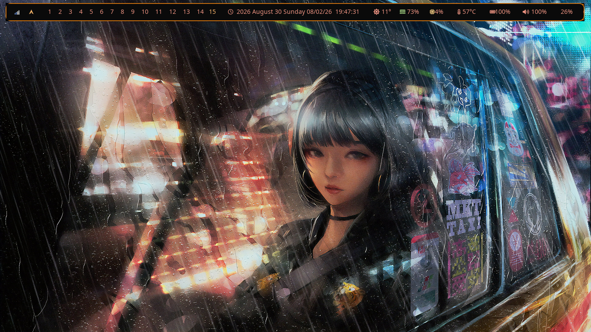
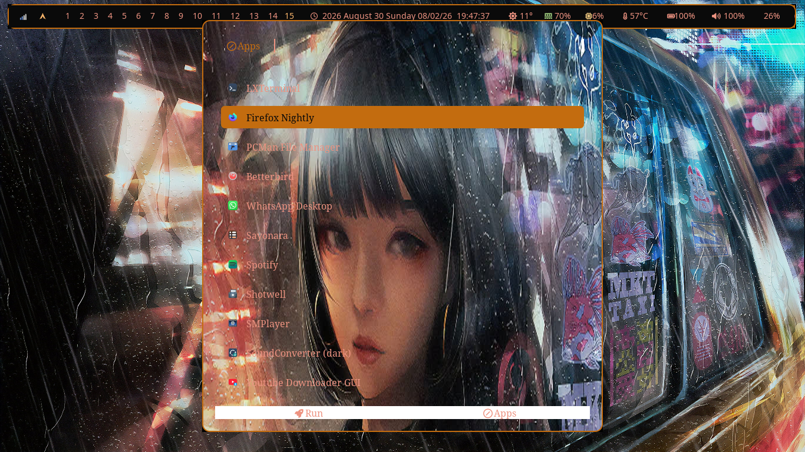
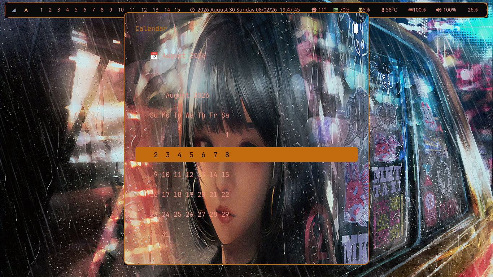
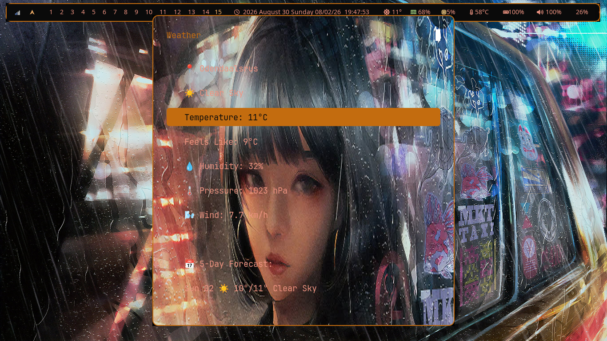
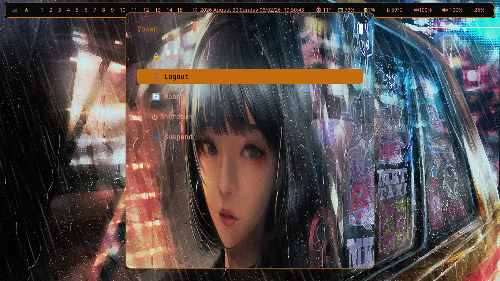

# LeftWM Dotfiles

  

Dynamic Tiling Window Manager on Arch Linux with Polybar.

---

## 📖 Documentation & Installation

For full installation instructions, keybinds, polybar configuration, and theming details, please visit the **[Official Documentation Website](https://wgparch.github.io/leftwm/)**.

## 📸 Screenshots

## 🎨 Features

- **Floating Polybar** with rounded corners and amber/coral theme
- **Rofi launcher** with cyberpunk wallpaper background
- **15 workspaces** with multiple layout options
- **Weather, Calendar, and Power menus**
- **nm-applet** integration

## 🚀 Quick Start

1. Clone this repository
2. Copy configs to \`~/.config/\`
3. Install dependencies (see documentation)
4. Start LeftWM from your display manager
